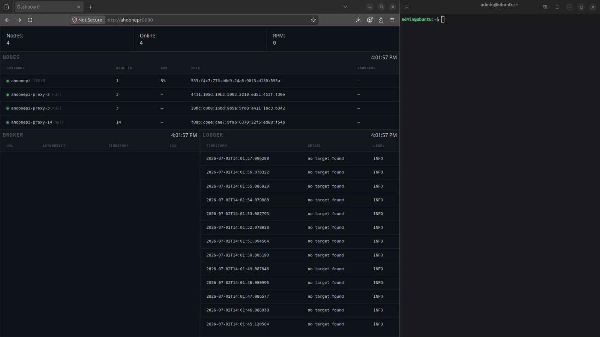

# ahoonepi-proxypi

**Stop paying for residential proxy APIs.**

`ahoonepi-proxypi` turns hardware you already own into your own self-hosted scraping mesh. A single `proxypi` bash CLI lets you control a fleet of machines (Raspberry Pis, VPS boxes, whatever) over WireGuard, while a broker distributes scraping jobs across containerized Chrome/Chromium instances running behind a virtual display (Xvfb): no headless fingerprints, no per-request billing, no third-party proxy pool.

Under the hood it's built on [zendriver](https://github.com/cdpdriver/zendriver) (the actively maintained continuation of [nodriver](https://github.com/ultrafunkamsterdam/nodriver)), so each request runs through a real, persistent, undetected browser instance rather than a bare HTTP client. Jobs are load-balanced across the fleet and tracked for Cloudflare/anti-bot artifacts so blocked nodes back off automatically.

## Why

|           | Residential proxy API        | ahoonepi-proxypi                           |
|-----------|------------------------------|--------------------------------------------|
| Cost      | Per-GB / per-request billing | Hardware you already own                   |
| Control   | Black box                    | Full source, full data locality            |
| Detection | Vendor's problem             | Real Chrome, virtual display, self-managed |
| Scale     | Pay to scale                 | Add another node                           |

## Demo



*Bringing up the stack and firing a scrape request end-to-end, see [Quickstart](#quickstart) below.*

## Quickstart

This quickstart let's you host the broker and one scraper on a single device.

```bash
git clone https://github.com/ahoone/ahoonepi-proxypi
cd ahoonepi-proxypi
echo "NODE_ROLE=LIGHTHOUSE,SCRAPER" > .env
./init.sh
sudo reboot
```

After rebooting:
```bash
cd ahoonepi-proxypi
source .bash_aliases
proxypi container-restart 1
xdg-open http://localhost:8080/
xdg-open http://localhost:8080/docs
```

## Usage

Be aware that the project runs for now with high control:
- runs with sudo rights,
- docker commmand line without sudo,
- creates a dummy user,
- preferably on a fresh installed OS.

Start the project on the main computer that will be the lighthouse.
Create a `.env` and complete just the `NODE_ROLE` field and launch `./init.sh` (handles dependencies, ie docker and wireguard).
After rebooting, check that a `broker` container is running.
You should be able to access the [dashboard](http://localhost:8080/) (or `HTTP_PORT_BROKER` if you changed the port from `config.env`) and the [API documentation](http://localhost:8080/docs).

To pursue the installation of proxies, creates an `admin` user (defined in `proxypi.sh`).
Complete the `.env` with the information you need from the lighthouse.
Be aware that the `PROXY_ID` should be unique among your network, and should be between 2 and 254 included.
On the lighthouse, run `proxypi load-ssh` and `proxypi load-wireguard`.
You should now see the proxy appear on the dashboard.

#### `.env`

```
LIGHTHOUSE_IP=  # Just required for the proxies (your home ip address, domain...)
LIGHTHOUSE_SSH_PORT=  # Just required for the proxies (port you need to open through your home router)
LIGHTHOUSE_WIREGUARD_PUBLIC_KEY=  # Just required for the proxies (using sudo wg0 show)
NODE_ROLE=  # LIGHTHOUSE, PROXY, SCRAPER
PROXY_ID=  # Just required for the proxies (integer between 2 and 254)
```
